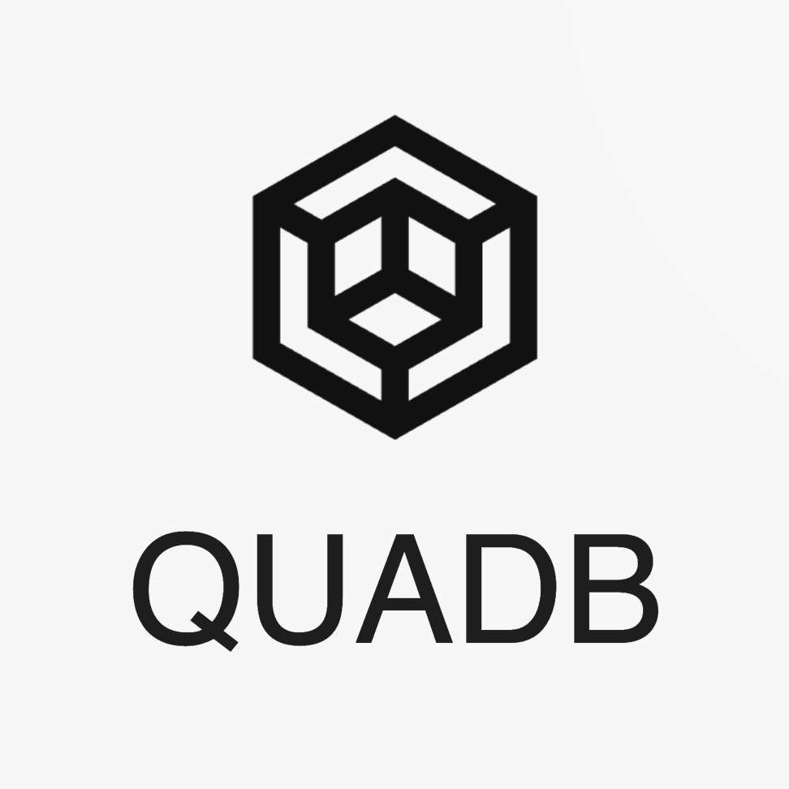

# Welcome to QUADB 🚀🧑‍🚀⚛

## A Submission for the ETHGlobal Brussels Hackathon 2024.

  

## Description📜

### Database Namespaces Protocol (QUADB)

**QUADB** is a groundbreaking protocol designed to revolutionize data management and access control in decentralized environments. With a focus on Web3 technologies and integration with Filecoin Naming Service (ENS), Tableland, Fleek, Lighthouse, QUADB aims to become the premier platform for data sharing, collaboration, and monetization in the decentralized web. Provides a structured and secure way to organize, share, and monetize datasets and associated codebases. Leveraging the power of IPFS and Filecoin networks, alongside advanced encryption techniques and smart contract capabilities, QUADB ensures data integrity, accessibility, and incentivized participation.

### [QUADB website](https://quad-db.vercel.app/)

### Key Features

- **Structured Namespace:** Users can create hierarchical namespaces under the root quadb.eth, facilitating organization and categorization of datasets and codebases.

- **Access Control:** Datasets can be designated as PUBLIC, GROUPED-PUBLIC, PAID-GROUPED, or PAID-PRIVATE, allowing fine-grained control over data access and curation.

- **Encryption:** Utilizes Lighthouse's encryption SDK to secure IPNS records, ensuring that only authorized curators can decrypt and modify dataset contents and associated code.

- **IPFS/Filecoin** Integration: All data and code are stored on the IPFS and Filecoin networks, providing decentralized storage and immutable data integrity.

- **Tableland Protocol:** Utilizes Tableland protocol for SQL indexing within smart contracts, enhancing data searchability and query efficiency.

- **Incentivization Mechanism:** Active users and subscribers are rewarded with QUADB tokens, encouraging engagement and contributions to the platform.

### 🧑‍💻 Acknowledgments & Technologies Used 🤖

We would like to thank the following individuals and organizations for their contributions and support in developing QUADB:

- LIGHTHOUSE(IPNS - IPFS - FILECOIN) 🔓
  - Storing and Encrypting Data on IPFS&Filecoin using the RAAS service. [code](https://github.com/nijoe1/QUADB/blob/main/app/utils/IPFS.js)
  - Making IPNS support multiple access to update records by encrypting and storing the Private key on tableland giving access only to dataset and code curators.
- Ethereum Naming Service (ENS) 🔮
  - Creating a graph of unified categories using ENSsubnames [code](https://github.com/nijoe1/QUADB/blob/main/contracts/contracts/libraries/ENS.sol)
  - The Domain that the contract holds [link on sepolia ens](https://app.ens.domains/quadb.eth?tab=subnames)
- MACIQV (Private Quadratic Voting) 
  - On QUADB users that can prove that they are Humans either with **Worldcoin** or **ZK-Emain KYC** or **Twitter Verification** they will have power into the platform to vote privatly for the datasets they think that matter most and bring value to everyone.
  - MACI QV contracts [link](https://github.com/nijoe1/QUADB/tree/main/MACIQV)
- Worldcoin 🕸️
  - Verify proof of humanity to let people vote on the zk QV round to fund the datasets that matter
- Tableland Protocol 🕸️
  - Tableland Queries [code](https://github.com/nijoe1/QUADB/blob/main/app/utils/tableland.js)

---

## Smart Contracts

- [QUADB Contract](https://github.com/nijoe1/QUADB/blob/main/contracts/contracts/QUADB.sol)

- [Tableland Integration Contract](https://github.com/nijoe1/QUADB/blob/main/contracts/contracts/libraries/Tableland.sol)

- [ENSIntegration Contract](https://github.com/nijoe1/QUADB/blob/main/contracts/contracts/libraries/ENS.sol)

**Authors:**

- [nijoe1](https://github.com/nijoe1)
